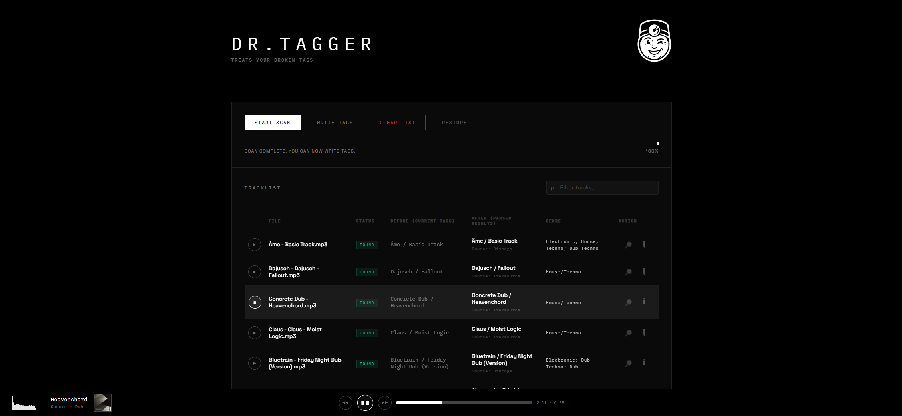
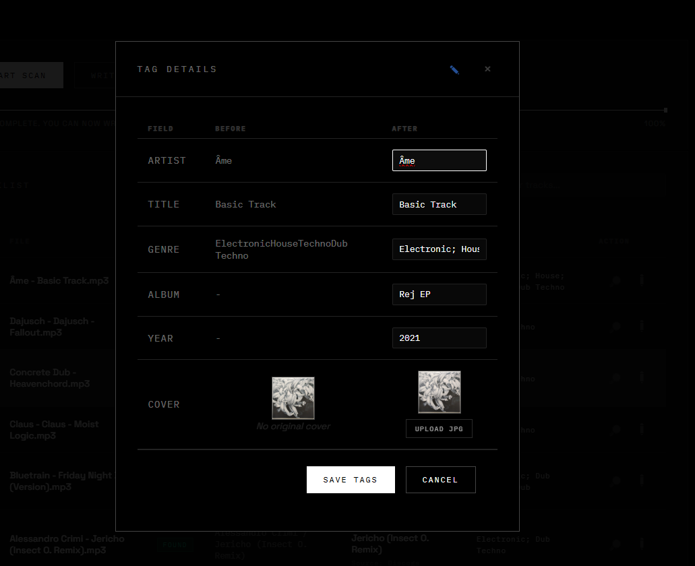
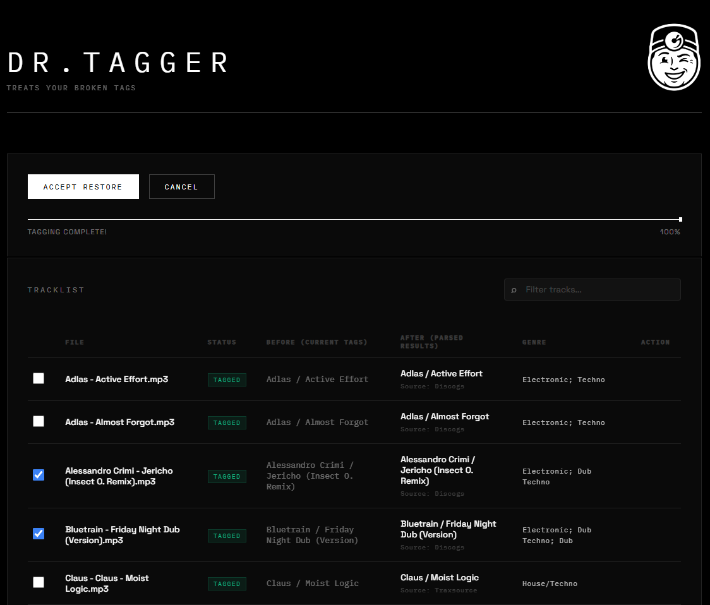

#  🩺 Dr. Tagger

> **Note**: Yes, this is an AI-powered project! 😉

**Treats your broken tags** — An intelligent MP3 auto-tagger with a sleek dark UI.

### 🌟 Project Mission
This project was born out of personal interest to solve the "messy library" problem, specifically helping with accurate tagging for **Techno** and electronic music genres where standard taggers often fail. 

I'm opening this up to the public and would love to develop it further based on community interest. **Feature requests and contributions are highly welcome!**

---

## ✨ Features

- **Auto-Tagging** — Scans your MP3 library and automatically identifies tracks via audio fingerprinting and metadata APIs.
- **Specialized Web Scrapers** — Enhanced identification for electronic music via custom scrapers for popular platforms (improves results where standard APIs fail).
- **Manual Search & Tagging** — Batch search and manually select perfect metadata from multiple providers.
- **Audio Playback** — Built-in player with volume, seeking, and real-time EQ visualization to preview your tracks.
- **Cover Art** — Automatic cover art embedding + manual JPG upload support.
- **Before/After Comparison** — Review original vs. proposed tags side-by-side in the Tag Details modal.
- **Backup & Restore** — Automatic backups before writing tags, with one-click restoration.

## 📸 Screenshots


*Modern dark UI with live progress and playback controls*

<details>
<summary>View More Screenshots</summary>


*Precise manual metadata selection*


*Easy backup management and restoration*

</details>

## 🔍 Metadata Sources & Scrapers

Dr. Tagger uses a combination of official APIs and specialized web scrapers to provide the best possible data for electronic music:

| Source | Method | Description |
|--------|--------|-------------|
| **AcoustID** | API | Core audio fingerprinting for initial identification |
| **Discogs** | API | Massive database for releases, genres, and styles |
| **Beatport** | Scraper | Specialized for Techno/House, provides BPM and Key data |
| **Traxsource** | Scraper | Excellent for underground House and Nu-Disco |
| **Juno Download** | Scraper | Broad electronic music coverage and release dates |
| **Bandcamp** | Scraper | Direct-from-artist metadata and high-quality covers |

> [!NOTE]
> The web scrapers are custom-built to help bridge the gap for techno-specific subgenres and titles that often aren't fully indexed in generic databases. They are continuously being refined to handle page layout changes.

## 🛠 Tech Stack

| Layer    | Technology                    |
|----------|-------------------------------|
| Backend  | Python, FastAPI, Uvicorn      |
| Frontend | Vanilla HTML/CSS/JS           |
| Database | SQLite (WAL mode)             |
| Audio    | Mutagen (ID3), Chromaprint    |
| APIs     | Discogs, Beatport, Traxsource |

## 🚀 Quick Start

### Prerequisites

- Python 3.10+
- **fpcalc** (Chromaprint CLI tool)
  - **Windows**: Place `fpcalc.exe` in the project root.
  - **Linux**: Install via package manager: `sudo apt install libchromaprint-tools`
  - **Docker**: Automatically included in the image.

### Installation

```bash
# Clone the repository
git clone https://github.com/akadawa/dr.tagger.git
cd dr.tagger

# Create virtual environment
python -m venv .venv

# Activate it
# Windows:
.\.venv\Scripts\activate
# Linux/Mac:
source .venv/bin/activate

# Install dependencies
pip install -r requirements.txt
```

### Configuration

```bash
# Copy the example environment file
cp .env.example .env

# Edit .env and add your Discogs API key
# Get one at: https://www.discogs.com/settings/developers
```

### Running

```bash
python -m uvicorn backend.main:app --host 0.0.0.0 --port 8002
```

Then open [http://localhost:8002](http://localhost:8002) in your browser.

## 📁 Project Structure

```
dr.tagger/
├── backend/
│   ├── main.py            # FastAPI server, API endpoints, WebSocket
│   ├── database.py        # SQLite database layer
│   └── tagger_engine.py   # Audio fingerprinting, API lookups, tag writing
├── frontend/
│   ├── index.html          # Main UI
│   ├── script.js           # Frontend logic
│   ├── style.css           # Dark theme styles
│   └── logo.png            # Dr. Tagger mascot
├── audiofiles/             # Drop your MP3 files here
├── backup/                 # Auto-created backups before tagging
├── covers/uploaded/        # Manually uploaded cover art
├── .env.example            # Environment template
├── requirements.txt        # Python dependencies
└── README.md
```

## 📖 Usage

1. **Drop MP3 files** into the `audiofiles/` directory (subdirectories supported)
2. **Click "Start Scan"** to begin automatic identification
3. **Review results** — tracks show status badges (FOUND, NOT FOUND, etc.)
4. **Manual search** — Click the 🔎 icon on unidentified tracks to search manually
5. **Upload covers** — Open Tag Details (✏ icon) and click "Upload JPG"
6. **Click "Write Tags"** to apply all changes to your files
7. **Restore** — Use the Restore button to revert any changes from backups

## 📝 License

MIT

---

## 🗺️ Roadmap & Future Tasks

We're just getting started! Here's what's planned for future releases:

- [x] **Linux Compatibility** — Abstract `fpcalc` path handling to support Linux systems natively.
- [x] **Docker Support** — Create a `Dockerfile` and `docker-compose.yml` for easy deployment.
- [x] **Official Docker Image** — Basic image structure created.
- [ ] **Expand Search APIs** — Integrate more metadata providers (e.g., MusicBrainz API directly, SoundCloud).
- [ ] **UI/UX Polishing** — Refine the dark theme, improve mobile responsiveness, and add more micro-animations.
- [ ] **Batch Metadata Editing** — Allow editing multiple tracks simultaneously.

### 💡 Tips for Synology/Older Docker Versions
If you get a "client version too new" error on Synology NAS or older systems:
1. Ensure the `version` attribute is removed from `docker-compose.yml` (done by default now).
2. You may need to set the environment variable `COMPOSE_API_VERSION=1.43` (or your max supported version) in your deployment tool.

Feel free to open an issue if you'd like to see a specific feature!
